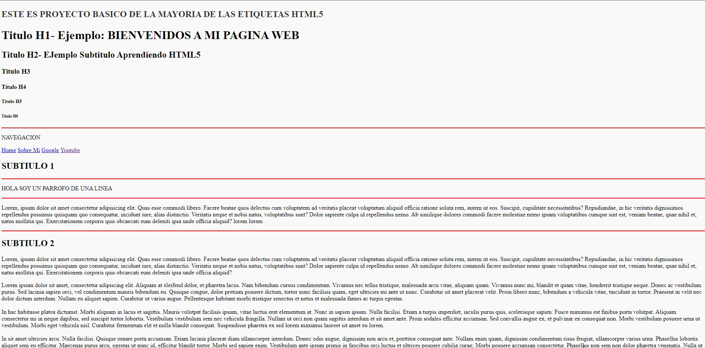

# Primer-ProyectoSimpleConEtiquetasHTML5

Este es mi primer proyecto simple utilizando etiquetas HTML5. El proyecto incluye archivos HTML, CSS y recursos multimedia, como imágenes, audio y video. Además, se proporciona un archivo CSS para estilizar las tablas.

## Contenido del Proyecto

- **index.html**: Página principal del sitio web.
- **sobremi.html**: Página adicional con información sobre mí.
- **Estilo_Tablas.css**: Archivo CSS para dar estilo a las tablas en las páginas HTML.
- **img/**: Carpeta que contiene imágenes utilizadas en el proyecto.
- **Audio/**: Carpeta que contiene archivos de audio utilizados en el proyecto.
- **video/**: Carpeta que contiene archivos de video utilizados en el proyecto.

## Link del Proyecto: https://juancitopena.github.io/ProyectoSimpleConEtiquetasHTML5/

## Captura de Pantalla:



## Cómo Usar

Simplemente clona este repositorio o descarga los archivos y ábrelos en tu navegador web favorito. Puedes navegar entre las páginas utilizando los enlaces proporcionados.

```bash
git clone https://github.com/tuusuario/Primer-ProyectoSimpleConEtiquetasHTML5.git
